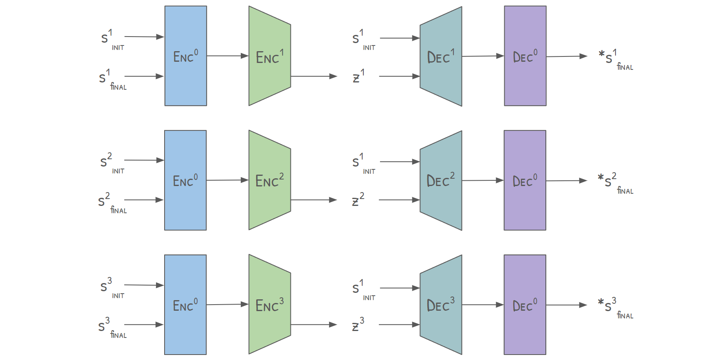
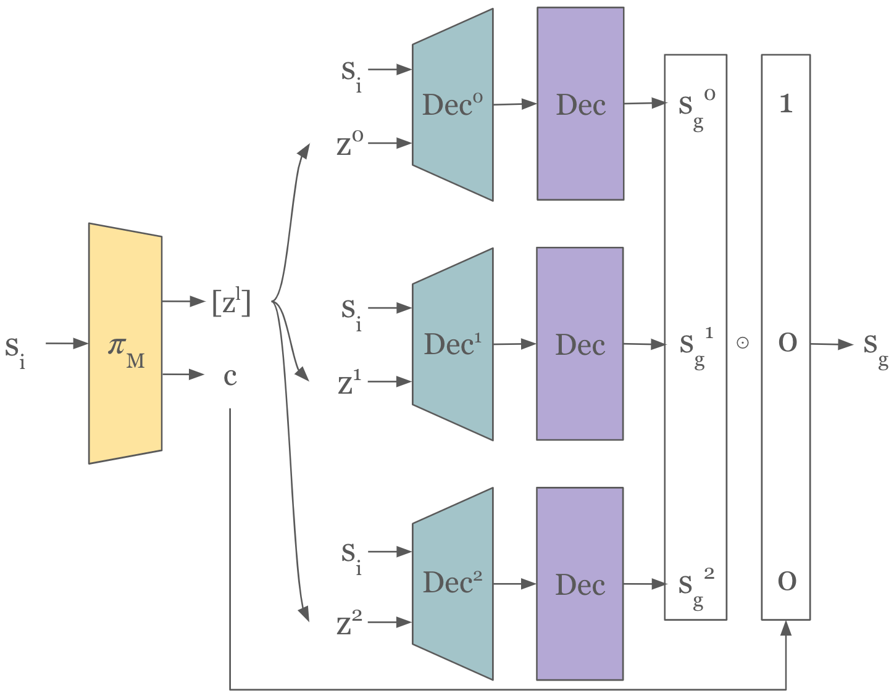
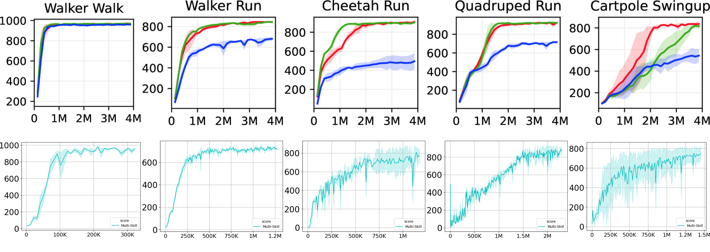
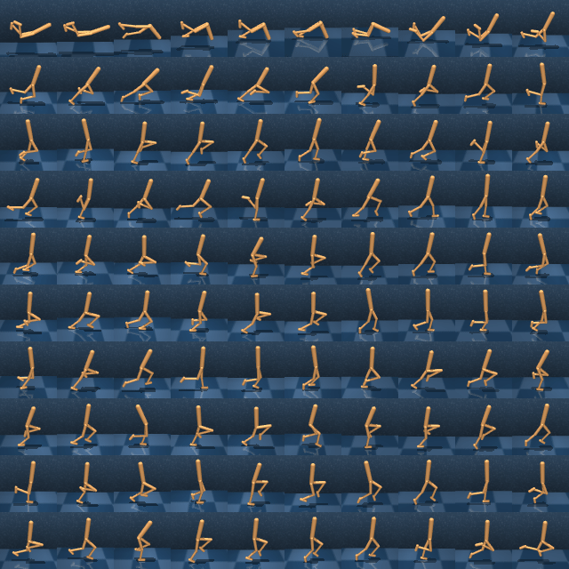
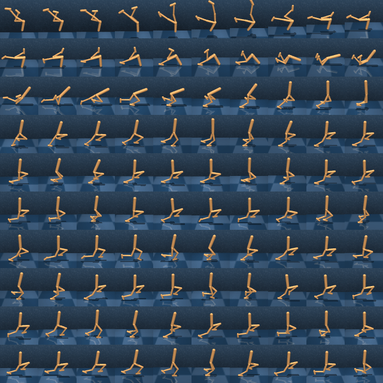
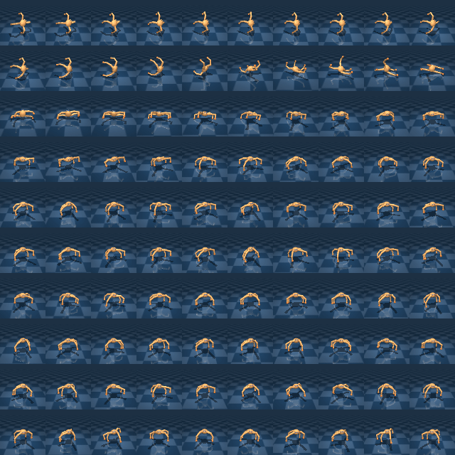
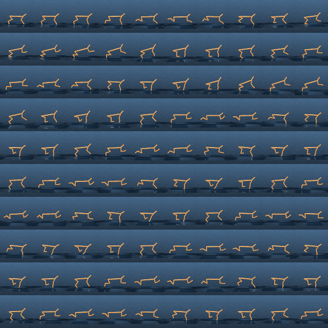
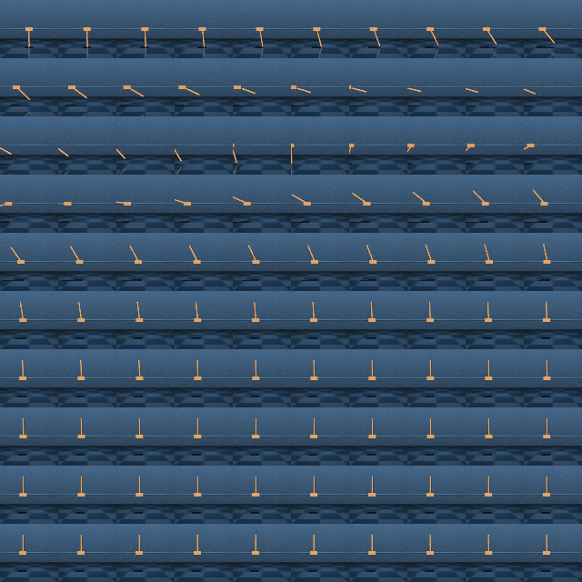

Code for the paper, 'Multi-Resolution Skill Discovery for Hierarchical Reinforcement Learning' published a Neurips'23 GCRL workshop [link](https://openreview.net/forum?id=23unYWTEM0).

# Overview

The agent is presented as a modification to the [Director](https://danijar.com/project/director/) [Hafner, D., Lee, K.H., Fischer, I. and Abbeel, P., 2022. Deep hierarchical planning from pixels. Advances in Neural Information Processing Systems, 35, pp.26091-26104.].

The Multi-Skill agent learns skills as intial and final goal state pairs using multiple Variational Autoencoders (VAE).

Each VAE learns skills at different temporal resolutions.



During acting, the agent generates goals from each skill VAE and then selects from those goals using a predicted categorial variable called choice.



If you find the paper useful, you can cite it as:

```
@article{sharma2023multi,
  title={Multi-Resolution Skill Discovery for Hierarchical Reinforcement Learning},
  author={Sharma, Shashank and Namboodiri, Vinay and Hoffmann, Janina},
  journal={NeurIPS 2023 Workshop on Goal-Conditioned Reinforcement Learning},
  year={2023}
}
```

# Running the code

Use ```embodied/Dockerfile``` to create a container and see the script ```launch.sh``` to run the code.

# Results

Evaluated on a few tasks from Deepmind Control Suite.



## Frames from acting

```walker_walk```


```walker_run```


```quadruped_run```


```cheetah_run```


```cartpole_swingup```

